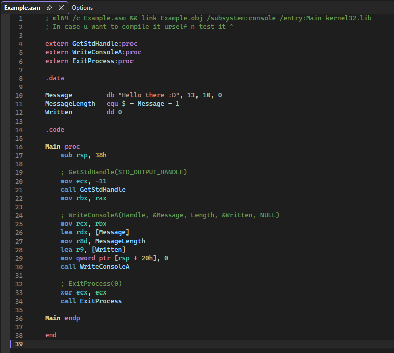
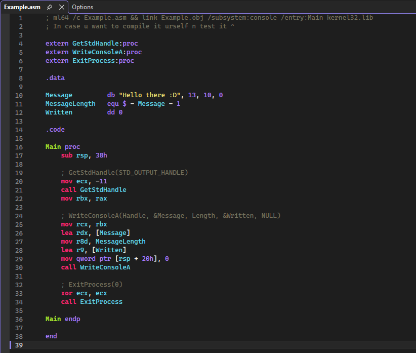
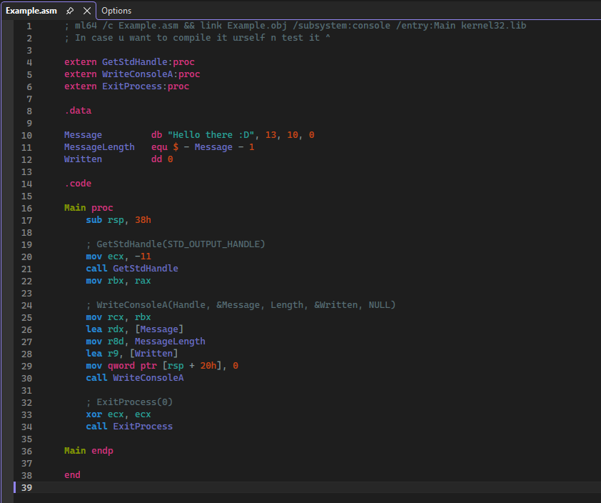

# AsmAssistant Pro

  <strong>专为 Visual Studio 2022+ 打造的高性能轻量级汇编开发与逆向学习扩展</strong>

  
  
  
  
  

---

## 📖 简介 (Introduction)

在 Windows 平台进行逆向工程分析、系统底层学习或汇编语言开发时，Visual Studio 默认对汇编源文件（`.asm`、`.inc`、`.masm`）的支持相对有限（通常表现为纯白纯文本、缺乏语义识别与代码补全）。

**AsmAssistant Pro** 是一款深度集成在 Visual Studio 内部的原生扩展，旨在提供**高精度的语法彩色着色、全量 x86/x64 与 MASM 智能代码补全（IntelliSense）、指令释义与寄存器提示**。采用 MEF 架构轻量化设计，零后台冗余进程，不卡顿编辑器，开箱即用。

---

## ✨ 核心特性 (Key Features)

- 🎨 **精准语法彩色高亮**：
  - 自动识别并区分汇编指令（Instructions）、通用/扩展寄存器（Registers）、MASM 伪指令（Directives）、标号、数据定义、立即数与注释。
  - 支持 `.asm`、`.inc`、`.masm` 多种扩展名。
- 💡 **智能代码自动补全 (IntelliSense)**：
  - 内置超过 140KB+ 的全量指令字典，键入时智能联想 x86/x64 指令与常用系统调用。
  - 自动提示寄存器名称与 MASM 常用伪操作（如 `.586`、`.model`、`proc`、`endp`）。
- 🎭 **内置多套流行配色主题**：
  - 提供 **Dark (默认深色)**、**Monokai**、**Solarized Dark** 等预设主题。
  - 与 Visual Studio 自身的“字体和颜色”系统完全联动，支持每个语法分词的独立微调。
- ⚡ **高性能与极速加载**：
  - 纯原生托管插件架构，零外部常驻进程，彻底告别老旧插件卡死或内存膨胀问题。

---

## 📸 效果预览 (Screenshots)

### 1. Dark (默认深色主题)

### 2. Monokai 主题

### 3. Solarized Dark 主题

---

## 📦 安装指南 (Installation)

### 方式一：一键双击安装（推荐）

本仓库已预先编译打包好安装包，无需配置编译环境：
1. 前往 **[GitHub Releases 页面](https://github.com/linken748/AsmAssistant-Pro/releases/latest)** 或直接点击下载：👉 **[AsmAssistant_Pro.vsix](https://github.com/linken748/AsmAssistant-Pro/releases/latest/download/AsmAssistant_Pro.vsix)**。
2. 确保已关闭运行中的 Visual Studio。
3. **双击 `AsmAssistant_Pro.vsix`**，在弹出的 VSIX 安装器窗口中点击 **Install**。
4. 安装完成后启动 Visual Studio 2022 即可自动生效！

### 方式二：从源码自行构建

1. 确保安装了 **Visual Studio 扩展开发**（Visual Studio extension development）工作负荷。
2. 使用 Visual Studio 打开工程文件 `BetterAsmHighlighter.sln`。
3. 选择 `Release` 配置并执行 **生成解决方案**（Build Solution）。
4. 编译生成的 `.vsix` 文件将输出在 `Source/bin/Release/` 目录下。

---

## ⚙️ 配置与个性化 (Configuration)

### 1. 切换内置主题
* 在 Visual Studio 顶部菜单栏依次点击：  
  👉 **工具 (Tools)** -> **选项 (Options)** -> **BetterAsmHighlighter** -> **Theme**。  
* 在下拉菜单中选择喜欢的主题预设（Dark / Monokai / Solarized Dark）。

### 2. 自定义语法颜色与字体
* 打开 **工具 (Tools)** -> **选项 (Options)** -> **环境 (Environment)** -> **字体和颜色 (Fonts and Colors)**。
* 在“显示项”列表中找到所有以 **`ASM - `** 开头的条目（如 `ASM - Instruction`、`ASM - Register` 等），自由设定喜欢的前景与背景色。

---

## 💻 运行环境要求 (Requirements)

| 环境项 | 最低要求 | 推荐配置 |
| :--- | :--- | :--- |
| **开发环境** | Visual Studio 2022 (v17.0 及以上) | 最新版 Visual Studio 2022 |
| **版本类型** | Community / Professional / Enterprise | 任意版本均可 |
| **系统架构** | Windows x64 (AMD64) | Windows 10 / 11 64 位 |
| **依赖运行时** | .NET Framework 4.7.2+ | 系统自带 |

---

## 🤝 参与贡献 (Contributing)

欢迎提交 Issue 反馈缺陷、建议指令集扩充或发起 Pull Request！
1. Fork 本仓库
2. 创建您的特性分支 (`git checkout -b feature/AmazingFeature`)
3. 提交变更 (`git commit -m 'Add some AmazingFeature'`)
4. 推送到远程分支 (`git push origin feature/AmazingFeature`)
5. 提交 Pull Request
